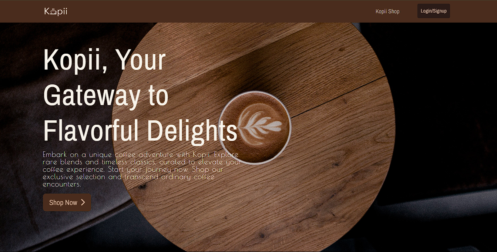

# Kopii



KodeGo Bootcamp E-Commerce Web Application. Developed in three stages: MP1 (wireframing, clickable prototype), MP2 (API Driven Web Application Built using React + Typesccript, RESTful API), CAPSTONE (full-stack web application)

### Quick Note:

it can take up to 5-10 minutes before it loads up for the first time and the reason for this is render.com free plan cold start and it happens only once, after that no more problems regarding page load-up.

#### Packages Used

- Redux Toolkit
- React
- Typescript
- Bootstrap 5.3
- SASS
- Axios
- Autoprefixer
- Reac Router DOM


## Getting Started

Install dependencies

```bash
  npm install
```

Run the development server:

```bash
  npm run dev
```

Complie SCSS to CSS

```bash
  npm run w
```